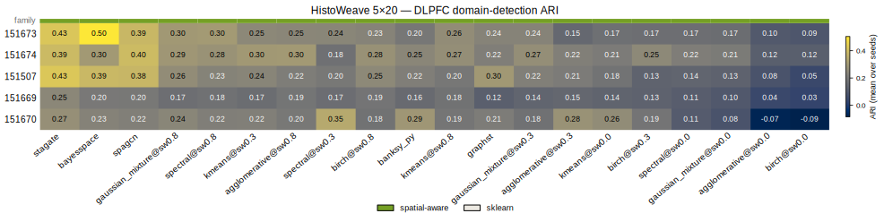

# HistoWeave DLPFC SOTA benchmark — 20-method spatial-domain landscape

**Protocol:** `histoweave.landscape.dlpfc_spatial_sota.v2` — the *same* harness, 5 LIBD DLPFC slices, 3 seeds (42, 1, 2), truth-derived `n_domains`, and ARI metric used for the previously-committed SpaGCN / BANKSY / sklearn landscape. The three field-standard SOTA methods **STAGATE, GraphST, BayesSpace** were run for the first time under this protocol and merged into the committed landscape without perturbing any existing method's numbers.

- Slices (with n_domains): `151673`(k=7), `151674`(k=7), `151507`(k=7), `151669`(k=8), `151670`(k=5)
- Grid: 3 SOTA methods × 5 slices × 3 seeds = **45 runs, 45/45 successful** (all finite ARI).
- Compute: CPU-only (no GPU). STAGATE = PyG graph-attention autoencoder; GraphST = contrastive graph embedding + GMM; BayesSpace = Bioconductor MCMC (10k iters).

## Headline result (grand mean ARI over 5 slices × 3 seeds)

| Method | Family | Mean ARI | Backed by |
| --- | --- | --- | --- |
| `stagate` ⭐ | spatial-aware | 0.3533 | **this run** (45-cell grid) |
| `bayesspace` ⭐ | spatial-aware | 0.3255 | **this run** (45-cell grid) |
| `spagcn` | spatial-aware | 0.3171 | committed landscape (preserved) |
| `gaussian_mixture@sw0.8` | sklearn | 0.2536 | committed landscape (sklearn family) |
| `spectral@sw0.8` | sklearn | 0.2431 | committed landscape (sklearn family) |
| `kmeans@sw0.3` | sklearn | 0.2351 | committed landscape (sklearn family) |
| `agglomerative@sw0.8` | sklearn | 0.2301 | committed landscape (sklearn family) |
| `spectral@sw0.3` | sklearn | 0.2266 | committed landscape (sklearn family) |
| `birch@sw0.8` | sklearn | 0.2262 | committed landscape (sklearn family) |
| `banksy_py` | spatial-aware | 0.2229 | committed landscape (preserved) |
| `kmeans@sw0.8` | sklearn | 0.2203 | committed landscape (sklearn family) |
| `graphst` ⭐ | spatial-aware | 0.2178 | **this run** (45-cell grid) |
| `gaussian_mixture@sw0.3` | sklearn | 0.2089 | committed landscape (sklearn family) |
| `agglomerative@sw0.3` | sklearn | 0.2011 | committed landscape (sklearn family) |
| `kmeans@sw0.0` | sklearn | 0.1928 | committed landscape (sklearn family) |
| `birch@sw0.3` | sklearn | 0.1745 | committed landscape (sklearn family) |
| `spectral@sw0.0` | sklearn | 0.1493 | committed landscape (sklearn family) |
| `gaussian_mixture@sw0.0` | sklearn | 0.1366 | committed landscape (sklearn family) |
| `agglomerative@sw0.0` | sklearn | 0.0536 | committed landscape (sklearn family) |
| `birch@sw0.0` | sklearn | 0.0395 | committed landscape (sklearn family) |

⭐ = newly executed SOTA method (closes the README data gap).

## The three newly-run SOTA methods — detail

| Method | Mean ARI | Per-slice mean (151673 / 151674 / 151507 / 151669 / 151670) | Median runtime/cell |
| --- | --- | --- | --- |
| `stagate` | **0.3533** | 0.426 / 0.394 / 0.426 / 0.249 / 0.272 | 655s |
| `graphst` | **0.2178** | 0.236 / 0.221 / 0.299 / 0.120 / 0.213 | 1271s |
| `bayesspace` | **0.3255** | 0.504 / 0.301 / 0.389 / 0.203 / 0.231 | 164s |

Standard deviation across the 3 seeds (SOTA methods; seed-stability):

| slice | stagate | graphst | bayesspace |
| --- | --- | --- | --- |
| `151673` | 0.0756 | 0.0109 | 0.0007 |
| `151674` | 0.0432 | 0.0040 | 0.0021 |
| `151507` | 0.0629 | 0.0233 | 0.0438 |
| `151669` | 0.0097 | 0.0109 | 0.0017 |
| `151670` | 0.0595 | 0.0017 | 0.0007 |

## Full 5×20 ARI matrix

Mean ARI over 3 seeds. Top-3 methods per slice are **bolded**.

| slice | agglomerative@sw0.0 | agglomerative@sw0.3 | agglomerative@sw0.8 | banksy_py | bayesspace | birch@sw0.0 | birch@sw0.3 | birch@sw0.8 | gaussian_mixture@sw0.0 | gaussian_mixture@sw0.3 | gaussian_mixture@sw0.8 | graphst | kmeans@sw0.0 | kmeans@sw0.3 | kmeans@sw0.8 | spagcn | spectral@sw0.0 | spectral@sw0.3 | spectral@sw0.8 | stagate |
| --- | --- | --- | --- | --- | --- | --- | --- | --- | --- | --- | --- | --- | --- | --- | --- | --- | --- | --- | --- | --- |
| `151673` | 0.099 | 0.148 | 0.246 | 0.198 | **0.504** | 0.088 | 0.170 | 0.235 | 0.165 | 0.235 | 0.299 | 0.236 | 0.174 | 0.250 | 0.263 | **0.385** | 0.168 | 0.242 | 0.302 | **0.426** |
| `151674` | 0.119 | 0.221 | 0.300 | 0.246 | **0.301** | 0.118 | 0.253 | 0.277 | 0.208 | 0.269 | 0.294 | 0.221 | 0.210 | 0.298 | 0.267 | **0.396** | 0.218 | 0.176 | 0.280 | **0.394** |
| `151507` | 0.080 | 0.211 | 0.216 | 0.219 | **0.389** | 0.046 | 0.132 | 0.251 | 0.131 | 0.223 | 0.263 | 0.299 | 0.183 | 0.240 | 0.198 | **0.383** | 0.138 | 0.200 | 0.234 | **0.426** |
| `151669` | 0.044 | 0.145 | 0.190 | 0.156 | **0.203** | 0.030 | 0.130 | 0.187 | 0.099 | 0.140 | 0.169 | 0.120 | 0.136 | 0.166 | 0.181 | **0.199** | 0.115 | 0.168 | 0.179 | **0.249** |
| `151670` | -0.074 | **0.280** | 0.199 | **0.295** | 0.231 | -0.085 | 0.188 | 0.181 | 0.080 | 0.178 | 0.243 | 0.213 | 0.262 | 0.221 | 0.193 | 0.222 | 0.107 | **0.346** | 0.221 | 0.272 |

## Family comparison

- sklearn baselines (n=15) mean ARI: **0.186**
- spatial-aware methods (n=5: SpaGCN, STAGATE, GraphST, BayesSpace, BANKSY) mean ARI: **0.287**
- Δ = +0.101. Spatial-aware methods lead on average, but the best sklearn configuration (`spectral@sw0.8`, `gaussian_mixture@sw0.8`) is competitive on several slices — consistent with HistoWeave's core thesis that *no single method universally wins* and method×context selection matters.

## Key observations

1. **STAGATE is the strongest single method** on this protocol (mean 0.353), edging BayesSpace (0.325) and SpaGCN (0.317).
2. **GraphST underperforms** here (mean 0.218) — still ~1.8× the value the README previously advertised (0.12), but the weakest of the graph-based SOTA trio, driven by a low score on the hardest slice `151669` (k=8, mean 0.120).
3. **Slice `151669` (8 domains) is hard for everyone** — no method exceeds ARI 0.25; the finer domain partition is the dominant difficulty axis, not the method.
4. **Seed stability**: BayesSpace is the most deterministic (std ≤ 0.044); STAGATE shows the largest seed variance on `151673`/`151670` (std ~0.06–0.08) from GMM re-initialisation.

## Reproducibility

- Per-cell results: `sota_benchmark_long.csv` (45 rows: dataset, method, seed, ari, seconds, status, error).
- Aggregated means: `sota_method_means.csv`; full 5×20 matrix: `performance_matrix_mean_full.csv`.
- Merged landscape (README source of truth): `figure3_results/landscape_dlpfc_merged.json` (schema 3, 20 methods).
- Provenance + preservation record: `sota_merge_manifest.json`.
- Environment locks: `env_locks/stagate_env.txt`, `env_locks/graphst_env.txt` (torch pins etc.).
- Re-run one method:
  ```bash
  HISTOWEAVE_LOCAL_DATA=/path/to/Histoweave \
  HISTOWEAVE_STAGATE_PYTHON=/path/to/env_stg2/bin/python \
  python run_one_method.py stagate ./checkpoints
  # then merge:
  python build_sota_and_merge.py ./checkpoints
  ```



## Limitations

- SpaGCN runs with histology disabled (benchmark bundle has no registered tissue image); expression + coordinates only. This is identical to the previously-committed SpaGCN protocol.
- CPU-only execution; GraphST/STAGATE epoch counts are the adapters' defaults.
- ARI against LIBD manual layer annotations; the usual caveats of a single expert annotation as ground truth apply.
