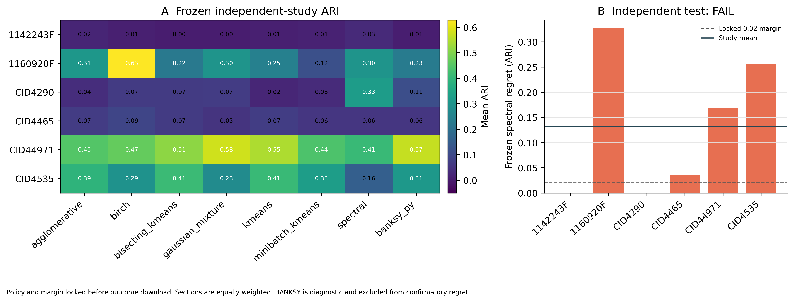

# Frozen independent test: Wu et al. 2021 breast-cancer cohort

## Independence and lock

This is a one-shot test on six primary breast cancers from an external study
(Zenodo DOI 10.5281/zenodo.4739739). Test identifiers were absent from the
training landscape, five-study external development benchmark, and prior TLS
discovery summary. The policy (`spectral`), seven-method comparator panel,
oracle-K task contract, and 0.02 ARI regret margin were locked before outcome
download in `preregistered_protocol.json`.

## Confirmatory result

- Evaluable patient/sections: **6**.
- Frozen spectral-policy mean regret: **0.1313 ARI**.
- Patient/section bootstrap 95% CI:
  **[0.0340, 0.2363]**.
- Locked success margin: **0.02 ARI**.
- Test decision: **independent_test_fail**.
- Spectral top-1 frequency: **33.3%**.

The decision uses the preregistered point-estimate rule. The confidence interval
is descriptive because this is one external study with six patient/sections.
Regardless of pass/fail, the result does not support personalised superiority.



## Per-section results

| Section | Frozen spectral ARI | Oracle method | Oracle ARI | Regret |
|---|---:|---|---:|---:|
| 1142243F | 0.0317 | spectral | 0.0317 | 0.0000 |
| 1160920F | 0.3014 | birch | 0.6284 | 0.3270 |
| CID4290 | 0.3257 | spectral | 0.3257 | 0.0000 |
| CID4465 | 0.0578 | birch | 0.0926 | 0.0348 |
| CID44971 | 0.4104 | gaussian_mixture | 0.5794 | 0.1689 |
| CID4535 | 0.1553 | bisecting_kmeans | 0.4121 | 0.2568 |


## Reproduction

```bash
python benchmark_external_validation/independent_test_wu2021/run_independent_test.py
```

Raw files are not redistributed by HistoWeave; download them from the DOI above.
