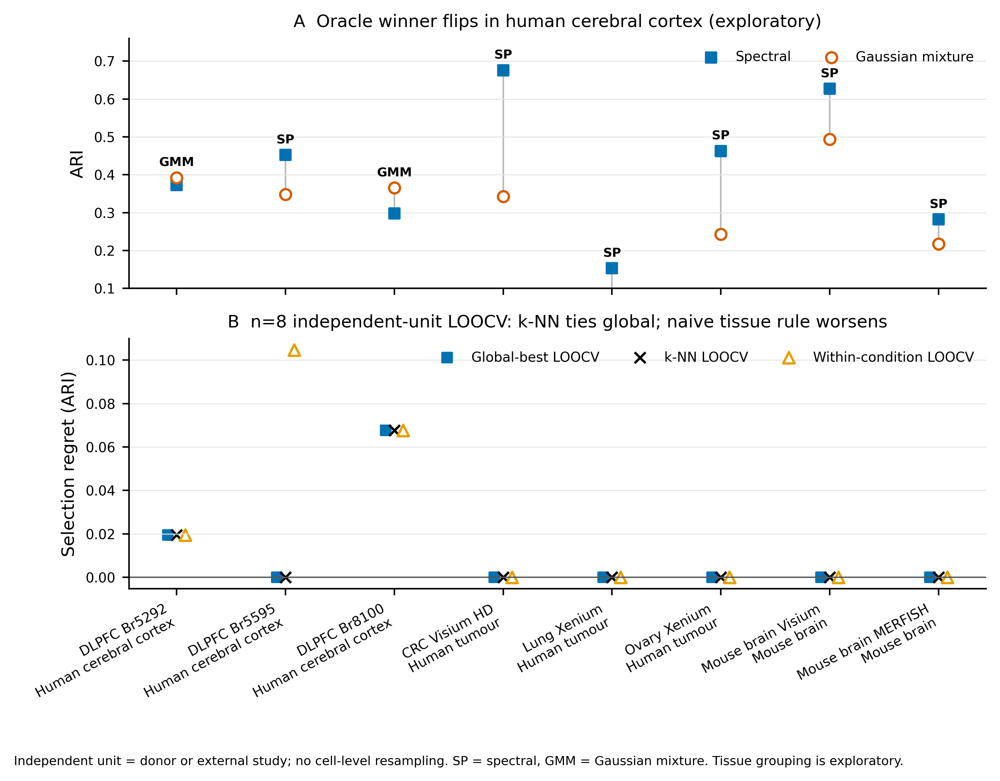

# Strict spatial-domain external validation: n=8

## Confirmatory result

The leave-one-independent-unit-out panel contains **8 units**: three DLPFC
biological donors and five external studies. Every unit uses anatomical,
pathology, or manually curated spatial-region ground truth; cell-type and
Leiden proxy labels are excluded.

- Gated/k-NN mean selection regret: **0.0109 ARI**
- Training-fold global-best mean regret: **0.0109 ARI**
- Paired difference: **0.0000**
  (95% bootstrap CI [0.0000,
  0.0000])
- Non-inferior at the predeclared 0.02 margin:
  **True**
- Superior to the global best: **False**
- Regret reduction versus a uniform random method: **90.3%**

This extends the earlier n=5 tie to n=8, but it does not demonstrate incremental
value over the global spectral default. The deployment decision therefore
remains global-default.

## Exploratory tissue-condition flip

The oracle winner is Gaussian mixture in 2/3 human cerebral-cortex donors and
spectral in 1/3. Spectral wins 3/3 human tumour studies and 2/2 mouse-brain
studies. Fisher exact p=0.107; the strata are
too small for a confirmatory tissue interaction claim.

The negative control is decisive: a naive same-condition LOOCV rule has mean
regret **0.0240**, worse than the global rule
(**0.0109**). The condition flip is therefore
a hypothesis for mechanism and future sampling, not a production selector.

## Scope and limitations

- Independent n counts donors or external studies, never cells or repeated slices.
- The three DLPFC donors come from one study and are not three laboratories.
- External-study feature vectors are partially observed; see the per-unit CSV.
- The strict common method panel has seven sklearn methods. SOTA method outputs
  remain in the broader benchmark but do not yet have complete n=8 coverage.
- All inferential claims use the strict spatial-domain task contract. Proxy-label
  imaging and cell-type datasets are excluded.
