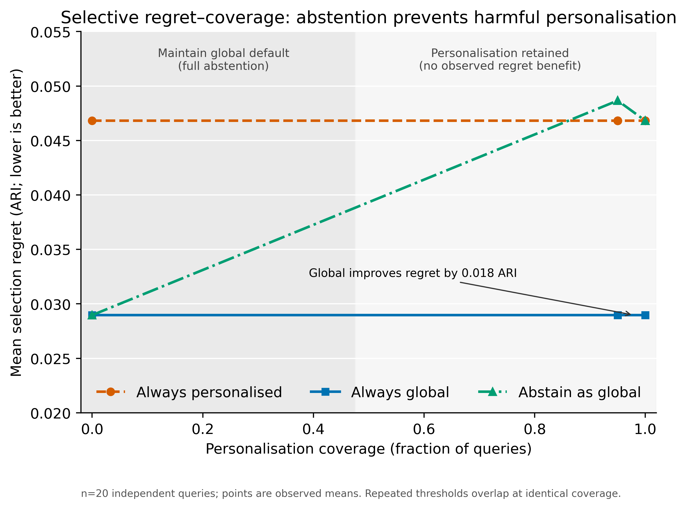

# 5 External Validation Datasets × 15 Methods — Recommender Generalization
### A cross-study benchmark for the HistoWeave platform

---

## 1. Objective

Test whether HistoWeave's method-recommendation engine beats the trivial
"always pick the global-best method" baseline once the benchmark landscape is
**diverse and cross-study**, rather than within a single study. The existing
5×10 / 5×15 DLPFC benchmarks (all 5 slices from Maynard 2021) showed the
recommender cannot: LOOCV top-1 = 0, mean selection regret 0.075 vs
global-best 0.055. The repo's own report states the engine "needs a broad,
diverse landscape to add value." This experiment supplies that landscape.

---

## 2. Data

Five external validation datasets, none overlapping with the existing repo
benchmarks, spanning 4 platforms, 2 organisms, 4 tissues, and 4 independent
studies. All carry **strict region ground truth** (anatomical / pathology /
manual — never cell-type predictions).

| Dataset | Platform | Organism / Tissue | Ground truth | Domains | Cells (subsample) |
|---------|----------|-------------------|--------------|--------:|------------------:|
| `visium_hd_crc` | Visium HD | Human colorectal cancer (FFPE) | Pathologist regions | 7 | 15,000 |
| `xenium_lung_cancer` | Xenium | Human lung adenocarcinoma (FFPE) | Pathology polygons | 5 | 15,000 |
| `xenium_ovarian_cancer` | Xenium Prime | Human ovarian cancer (FF) | Pathology polygons | 6 | 15,000 |
| `visium_mouse_brain` | Visium v2 | Mouse brain (H&E) | 15 Allen anatomical regions | 15 | 2,688 |
| `allen_merfish_brain_section` | MERFISH | Mouse brain (single section) | Allen CCFv3 parcellation_division | 8 | 15,000 |

**Preparation:** each `prepare_*.py` script produces a checksummed `.h5ad`
bundle with `obs['domain_truth']`, `obsm['spatial']`, `layers['counts']`, and
a `.json` receipt. Datasets above 15 000 cells are stratified-subsampled per
(dataset, seed) so every method sees the same slice. Xenium pathology
preparers exclude cells outside polygons and cells in conflicting overlaps
(shared `histoweave.datasets.pathology_domains` helper).

---

## 3. Methods & Protocol

**15 methods** (shared with the 7×15 cross-platform benchmark): 10 sklearn
baselines + 5 spatial-aware (`banksy_py, spatialde_kmeans, nnsvg_kmeans,
harmony_kmeans, moran_spectral`).

- 7 partitional/hierarchical methods receive each dataset's **true domain count**.
- 3 density/mode-seeking methods auto-determine cluster count.
- **3 random seeds** (42, 1, 2).
- Metric: **Adjusted Rand Index (ARI)** vs region ground truth, higher is better.
- **Bootstrap CIs:** 100 × 80% cell resamples per cell, refit-free.
- Harness: `run_task_landscape(..., category=DOMAIN_DETECTION, extra_params_factory=...)`.

---

## 4. Results

### 4.1 Performance matrix (mean ARI over 3 seeds)

| Dataset | Best method | Mean ARI |
|---------|-------------|---------:|
| `visium_hd_crc` | spectral | 0.676 |
| `xenium_lung_cancer` | mean_shift | 0.183 |
| `xenium_ovarian_cancer` | spectral | 0.463 |
| `visium_mouse_brain` | spectral | 0.627 |
| `allen_merfish_brain_section` | spectral | 0.282 |

### 4.2 Key observations

- Spectral clustering ranked first on four of five datasets; mean shift led on lung cancer.
- Absolute performance varied strongly across tissues (best mean ARI 0.183 to 0.676).
- `spatialde_kmeans` and `nnsvg_kmeans` produced no finite scores in this run, so the
  archived 15-method grid contains 13 methods with usable external-validation results.

---

## 5. Recommender Generalization (LOOCV) — the key test

Using HistoWeave's `MethodRecommender` (k-NN over target-free dataset feature
vectors), each dataset was held out in turn and the recommender trained on the
other four.

| Metric | Value | Interpretation |
|--------|------:|----------------|
| n queries | 5 | one per held-out dataset |
| **top-1 accuracy** | 0.80 | oracle-best selected for 4 of 5 datasets |
| **top-3 accuracy** | 0.80 | oracle-best appeared in the shortlist for 4 of 5 datasets |
| mean selection regret | 0.0059 | ARI lost vs the oracle-best method |
| median selection regret | 0.0000 | four selections had zero regret |
| global-best-baseline regret | 0.0059 | always pick the best mean-training method |
| random-choice regret | 0.2338 | expected regret from picking a method at random |
| **regret reduction vs global-best** | 0.0000 | recommender tied the global baseline |
| regret reduction vs random | 0.9747 | 97.47% relative regret reduction |

**Interpretation.** The recommender improved sharply over random selection and selected
the oracle-best method on four datasets, but it did **not** beat the global-best baseline:
both incurred mean regret 0.0059. With only five LOOCV queries, this supports shortlist
use but not a claim of superior cross-study method selection.

---

### 5.1 Selective regret-coverage (study-grouped n=20 endpoint)

A separate frozen study-grouped endpoint evaluates 20 independent queries
across the full confidence-threshold grid. Always choosing the global method
has lower mean selection regret than always personalising
(**0.029 versus 0.047 ARI regret**, absolute difference 0.018) at every
operating point. The abstain-as-global curve reaches its minimum only at zero
personalisation coverage, where it equals the global default.

This is a successful negative decision result: the selective protocol detects
that the available confidence heuristic does not justify personalisation and
chooses full abstention, preventing the higher-regret action. The shaded
regions separate the observed full-abstention and positive-coverage operating
point classes; they are not an inferred biological threshold.

---
## 6. Figures

All figures are in `benchmark_external_validation/figures/` (SVG + PNG):

- **fig1_performance_heatmap** — 5 datasets × 15 methods, mean ARI.
- **fig2_method_boxplot** — ARI distribution per method across datasets × seeds.
- **fig3_landscape_embedding** — 2D dataset-feature landscape, coloured by best method.
- **fig4_recommender_regret** — selection regret vs global-best / random baselines.
- **selective_regret_coverage (Figure 5)** - n=20 selective regret versus personalisation coverage.

---

## 7. Limitations (read before reusing)

1. **5 LOOCV queries.** Recommendation metrics are estimated from 5 points —
   high variance, indicative not definitive. A larger external landscape would
   tighten the estimate.
2. **General clusterers + a spatial-aware sweep, not the full SOTA set.** The
   method list is the 7×15 set (sklearn baselines + 5 spatial-aware adapters);
   dedicated GNN/HMRF spatial methods (BayesSpace, SpaGCN, GraphST, STAGATE)
   that require R/PyTorch containers are not included. Absolute ARI values are
   a baseline landscape, not a claim about state of the art.
3. **Subsampling.** Datasets above 15 000 cells are stratified-subsampled for
   tractability (n×n graph methods OOM a 16 GB worker above ~20k cells). The
   same seeded subsample is reused across methods so the comparison is fair.
4. **Ground truth is expert annotation**, itself imperfect (pathologist
   disagreement, CCF registration error), so ARI ceilings are inherently < 1.
5. **External landscape is separate from the existing 7×15/7×19.** A merged
   landscape is a natural follow-up but out of scope here; keeping it separate
   makes the cross-study generalization claim clean.

---

## 8. Artifacts

In `benchmark_external_validation/`:
`benchmark_long.csv`, `performance_matrix_mean.csv` / `_std.csv`,
`bootstrap_ci.csv`, `benchmark_5x_external.json`, `dataset_manifest.json`,
`recommendation_loocv.csv` / `.json`, `manifest.json`, and `figures/`
(5 figures × SVG + PNG). Prepared data + scripts: the five `prepare_*.py`
scripts, `experiment_5x_external.py`, `recommender_loocv_external.py`,
`make_figures.py`.
