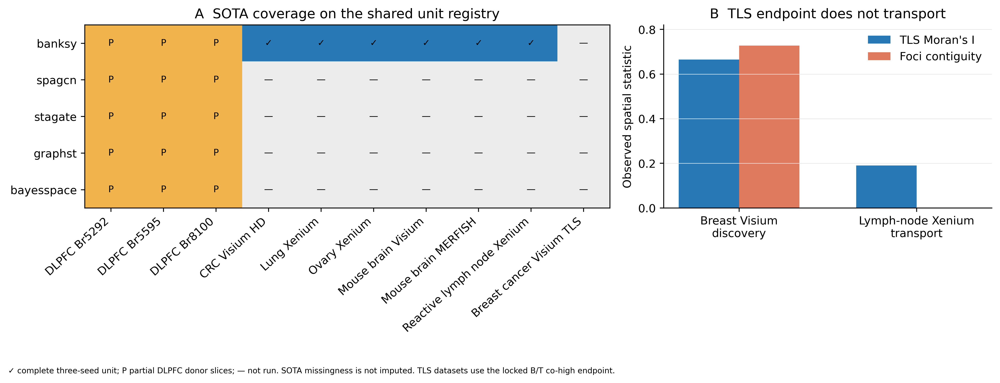

# Strict task-stratified external panel v2

## Panel definition

The registry contains **10 independent units**. Nine units have
anatomical/pathology spatial-domain ground truth and enter the common-panel
LOOCV; two datasets carry TLS evidence, with the reactive lymph-node Xenium
unit shared between strata. Task-ineligible cells remain explicit and are not
converted into pseudo-ground truth.

## Spatial-domain decision endpoint (n=9)

- Gated-policy mean regret: **0.0097 ARI**.
- Training-fold global-best mean regret: **0.0097 ARI**.
- Non-inferior at margin 0.02: **True**.
- Superior to global best: **False**.

The lymph-node pathology unit increases the independent-unit endpoint from
n=8 to n=9. It does not unlock personalisation; the global default remains the
deployment policy.

## SOTA coverage on the same registry

BANKSY-Python has scores for 9/10
registry units and all nine domain units, but its three DLPFC donor cells use
selected slices rather than every donor-member slice. SpaGCN, STAGATE, GraphST,
and BayesSpace remain DLPFC-only. Consequently, **no SOTA method enters the
confirmatory n=9 LOOCV**, and no missing cell is imputed. The coverage matrix is
an audit and a precise execution backlog, not a completed SOTA comparison.

## TLS second dataset

The breast Visium TLS signal (Moran's I 0.665,
contiguity 0.727) did not transport to the
cell-resolved reactive lymph-node Xenium dataset (Moran's I
0.190, contiguity
0.000; pathology-GC F1
0.000). This is a negative external result.
It motivates assay-aware neighbourhood endpoints and preserves the discovery
claim as single-sample rather than general TLS validation.



## Reproduction

```bash
python research/phaseB_tls_consensus/analyze_tls_second_dataset.py
python benchmark_external_validation/evaluate_banksy_lymph.py
python benchmark_external_validation/strict_external_panel_v2/build_strict_external_panel_v2.py
```
