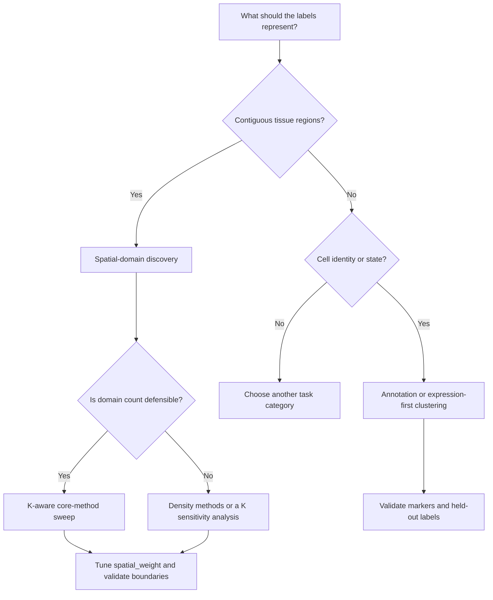

# Method selection guide

HistoWeave provides a common interface to many spatial-transcriptomics methods, but a
common interface does not make the methods interchangeable. Method selection should follow
this order:

1. define the biological target (**task contract**);
2. check computational feasibility (scale ceiling, sparse path);
3. choose a small candidate set (baselines + SOTA for the task);
4. tune the **spatial-context policy** and domain count together;
5. validate against evidence that matches the target;
6. when uncertain, run a short multi-method ensemble and inspect disagreement regions.

The analysis target is more important than the platform name. A Visium cortical-layer
analysis and a Xenium cell-type analysis do not ask the same statistical question, even
though both contain expression and coordinates.

The primary benchmark therefore uses a phenomenon × observation-condition capability
matrix rather than a platform leaderboard. Use its role/category-conditioned summaries
to screen candidates, then use study-matched real data to validate the final choice.
Preprocessing, direct inference, integration, and ingestion methods must not be collapsed
into one global rank. See the [phenomenology benchmark](phenomenology-benchmark.md) for
the frozen applicability contracts and failure semantics.


!!! danger "Never use Leiden / self-clustering as spatial-domain ground truth"
    Task contracts reject `self_supervised` labels for `spatial_domain` evaluation.
    Cross-platform ARI tables that mix expert layers with expression-derived clusters
    are not scientifically comparable.

## Recommendation engine v2

Use `MethodRecommender` with explicit `task` and `platform` priors. Inspect:

- `beats_global_best_baseline` — if `False`, prefer the global default or an ensemble;
- `selection_regret_vs_global_best` — expected metric loss vs always-pick-global-best;
- `warnings` — narrow knowledge base, platform mismatch, cross-task neighbours.

Configurations may appear as `method@sw0.8` (method + spatial-context policy).

!!! danger "Do not use one spatial-weight default for every task"
    For recovery of contiguous tissue domains, start with moderate and strong spatial
    priors. For recovery of cell identity or transcriptomic clusters, start with
    expression-only and add spatial weight only if validation supports it. The HistoWeave
    cross-platform benchmark found opposite optima for these two objectives.

## Quick decision table

| Analysis target | Appropriate evidence | First candidates | Spatial-weight sweep |
|---|---|---|---|
| Contiguous tissue architecture, layers, niches | Expert spatial-domain labels, histology, boundary agreement | `gaussian_mixture`, `spectral`, `agglomerative`, `banksy`, `banksy_py` | `0.3`, `0.8`; include `0.0` as a control |
| Cell identity or transcriptomic state | Cell-type labels, marker coherence, held-out reference mapping | Annotation methods first; if clustering, `spectral`, `agglomerative`, `gaussian_mixture` | `0.0`, `0.3`; treat `0.8` as a stress test |
| Unknown domain count and irregular density | Stability, noise fraction, marker coherence, morphology | `dbscan`, `optics`, `mean_shift` | Tune jointly with density parameters |
| Known or defensible domain count, small/medium data | ARI when labels exist; otherwise stability and boundary evidence | The five core benchmark methods | `0.0`, `0.3`, `0.8` |
| Large single-cell imaging assay | Subsample/tiles plus stability checks | `minibatch_kmeans`, `birch`, `bisecting_kmeans` | Prefer `0.0` until spatial-neighbour construction is feasible |
| Partial cell-type labels | Held-out label accuracy and marker coherence | `scanvi` in the **annotation** category | Not a domain-detection substitute |

`spatial_weight=0.3` is the library default for the generic sklearn-family clusterers. It
is a useful middle point, not a universal recommendation.

## Start with the question, not the method



Use the other HistoWeave categories when the scientific output is not a spatial partition:

- **annotation** for per-cell or per-spot biological identities;
- **svg** for genes with spatially structured expression;
- **deconvolution** for cell-type mixtures in spots;
- **ccc** for ligand-receptor communication;
- **segmentation** for image-derived cell boundaries.

A clustering that agrees with cell-type labels is not automatically a good tissue-domain
map, and a spatially smooth domain map is not automatically a good cell-type classifier.

## What the new benchmarks establish

Three benchmark tracks provide the direct evidence used by this guide:

- `5x15_spatial_aware/`: five DLPFC Visium slices, five core methods, three spatial
  weights, three seeds, and expert cortical-layer labels;
- `7x15_cross_platform/`: the same 15 configurations on five Visium slices plus MERFISH,
  Slide-seqV2, and Xenium;
- `benchmark_external_validation/`: five external validation datasets × 15 methods × 3
  seeds, with **strict region ground truth only** (anatomical / pathology / manual —
  never cell-type predictions), spanning Visium HD, Xenium, Xenium Prime, Visium v2, and
  MERFISH across human colorectal/lung/ovarian cancer and mouse brain. This track is the
  cleanest recommender-generalization test because every dataset carries real region
  labels rather than proxy cell-type clusters.

The 15 configurations are:

```text
{kmeans, gaussian_mixture, agglomerative, spectral, birch}
    x spatial_weight {0.0, 0.3, 0.8}
```

### Within-study DLPFC result

Mean ARI across methods, slices, and seeds increased with spatial weight:

| `spatial_weight` | Mean ARI | Change from expression-only |
|---:|---:|---:|
| `0.0` | 0.114 | reference |
| `0.3` | 0.209 | +83% |
| `0.8` | 0.235 | +106% |

The highest overall DLPFC configuration was `gaussian_mixture@sw0.8` (mean ARI 0.254),
followed by `spectral@sw0.8` (0.243). Four of five slices were won by a configuration with
`spatial_weight=0.8`; the remaining slice was won by `spectral@sw0.3`.

### Cross-platform result

The preferred weight changed with the meaning of the reference labels:

| Platform and reference target | `sw0.0` | `sw0.3` | `sw0.8` | Empirical starting point |
|---|---:|---:|---:|---|
| Visium, expert spatial layers | 0.114 | 0.209 | **0.235** | strong spatial prior |
| MERFISH, proxy cell class | **0.378** | 0.307 | 0.042 | expression-only |
| Slide-seqV2, proxy cluster | 0.050 | **0.075** | 0.067 | moderate prior, weak evidence |
| Xenium, proxy Leiden cluster | **0.494** | 0.458 | 0.242 | expression-only |

This is not evidence that coordinates are unhelpful for MERFISH or Xenium. It shows that
heavy smoothing is harmful when success is defined by non-spatial cell-identity proxies.
Change the target, and the preferred prior may change.

### Limits on interpretation

The results are conditional on the benchmark design:

- Only Visium had expert spatial-domain ground truth. The other labels are proxies.
- The benchmark supplied the true/proxy number of domains to K-aware methods. Performance
  will be lower or less stable when `n_domains` is unknown.
- The three imaging/bead datasets were capped near 6,000 observations for memory safety.
- The benchmark tested five generic clusterers, not every registered method.
- BANKSY was not included because its canonical implementation required an R container
  that was unavailable in that execution environment.
- Eight datasets are enough to expose a failure mode, not enough to establish a universal
  platform ranking.

Treat the tables as priors for candidate selection, not as claims of universal superiority.

## Understanding `spatial_weight`

For the generic clusterers, HistoWeave computes a PCA expression embedding `E`, averages it
within a spatial k-neighbourhood to obtain `N(E)`, standardizes both terms, and uses:

```text
joint_embedding = (1 - spatial_weight) * zscore(E)
                + spatial_weight * zscore(N(E))
```

Therefore:

- `0.0` means expression-only clustering;
- `0.3` adds a moderate neighbourhood prior;
- `0.8` strongly favours locally averaged structure;
- `1.0` removes the direct expression term and is rarely a sensible first run.

A high value can improve contiguous layers while erasing intermixed cell states. It can
also make a poor result look visually smooth, so spatial coherence cannot be the only
selection criterion.

### Recommended tuning protocol

1. Run `0.0`, `0.3`, and `0.8` on the same normalized input.
2. Hold `n_domains`, `n_pcs`, `n_neighbors`, and preprocessing fixed.
3. Repeat stochastic methods with at least three fixed seeds.
4. Compare biological evidence, stability, boundaries, fragmentation, and runtime.
5. Refine around the best region only if the conclusion is stable.

Do not tune the weight against labels that do not represent the intended output. For
example, optimizing a tissue-domain workflow against cell-type labels selects for the
wrong estimand.

## Choosing among domain-detection methods

### Directly benchmarked core methods

| Method | Prefer when | Strengths | Main risks and checks |
|---|---|---|---|
| `gaussian_mixture` | A defensible `n_domains` exists and clusters may overlap in PCA space | Soft posterior probabilities; best mean DLPFC configuration at `sw0.8` | Gaussian-component assumption; inspect posterior uncertainty and seed stability |
| `spectral` | Non-convex structure is plausible and the dataset is modest | Won two benchmark datasets; strong DLPFC and MERFISH configurations | More expensive; sensitive to neighbourhood graph and requested K |
| `agglomerative` | Hierarchical tissue organization or deterministic tree cuts are useful | Won two DLPFC slices plus the Slide-seqV2 and Xenium rows | Ward geometry can force merges; inspect dendrogram-like K sensitivity |
| `kmeans` | A transparent, fast baseline is needed | Simple and reproducible; strong DLPFC result at `sw0.3` | Spherical equal-variance bias; requires K |
| `birch` | Incremental CF-tree clustering is useful after embedding | Scalable clustering stage and compact summaries | Spatial embedding can still dominate memory; threshold needs tuning |

A defensible first panel for spatial-domain discovery is:

```text
gaussian_mixture@sw0.8
spectral@sw0.8
agglomerative@sw0.8
kmeans@sw0.3
expression-only control for the same methods
```

For cell-identity proxy recovery, reverse the weight priority and begin with `sw0.0`.

### Other production methods

These methods are registered and production-labelled, but the 5x15/7x15 experiments do
not directly rank them:

| Method | Use case | Key parameters |
|---|---|---|
| `minibatch_kmeans` | Faster centroid fitting on larger inputs | `n_domains`, `batch_size`, common embedding parameters |
| `bisecting_kmeans` | Hierarchical divisive K-means baseline | `n_domains`, common embedding parameters |
| `dbscan` | Unknown K, irregular clusters, explicit noise | `eps`, `min_samples` |
| `optics` | Unknown K with varying density | `min_samples`; inspect reachability behaviour |
| `mean_shift` | Automatic mode discovery on modest data | `bandwidth`; can be computationally expensive |
| `banksy` | Canonical neighbourhood-augmented spatial domains | `lambda_param`, `k_geom`, graph algorithm/resolution; requires R container |
| `banksy_py` | Docker-free prototype using BANKSY-like features | `lambda_param`, `k_geom`, `n_domains`; not identical to Bioconductor BANKSY |

Do not infer that an unbenchmarked method is worse. Its status means only that this
specific evidence does not rank it.

### Experimental research methods

The registry also exposes `weave_boundary_aware_domains`,
`weave_multiscale_consensus_domains`, `weave_topology_regularized_domains`, and
`weave_uncertainty_domains`. They are marked **experimental** with unvalidated novelty.
Use them for research comparisons, not as an unqualified production default. Always pair
them with at least one production baseline and preserve the full provenance record.

## Domain count is a model choice

The 5x15 and 7x15 results used the reference label count as `n_domains`. In real analysis,
K is often unknown.

When K has biological support, use it and state the source: known cortical layers,
histological compartments, or a preregistered hypothesis. Otherwise:

1. define a plausible K range before inspecting the final answer;
2. run the same method/weight panel across that range;
3. measure adjusted mutual information or ARI between repeated runs;
4. inspect marker separation and spatial boundaries;
5. reject solutions driven by tiny unstable clusters;
6. report the sensitivity rather than presenting one K as discovered truth.

Density methods avoid an explicit K but replace it with equally consequential density
parameters. They are not parameter-free.

## Scale and memory constraints

The current generic spatial embedding calls the brute-force neighbourhood implementation
in `histoweave._math.knn_indices`. Its distance construction is quadratic in observation
count. The downstream clusterer may be scalable while the spatial preprocessing step is
not.

!!! warning "BIRCH does not remove the spatial-neighbour bottleneck"
    Choosing `birch` or `minibatch_kmeans` helps the clustering stage. With
    `spatial_weight > 0`, the current neighbourhood construction can still exhaust memory
    before clustering begins.

For large imaging assays:

- run an expression-only baseline first;
- use a fixed, documented subsample for method/parameter screening;
- prefer biologically meaningful tiles or fields of view over arbitrary truncation;
- repeat across tiles to test transfer;
- avoid spectral clustering on full-resolution data until feasibility is demonstrated;
- record the sampling seed and retained label proportions;
- do not compare a subsampled result with a full-data result as if compute were matched.

The cross-platform preparation scripts used a 6,000-observation cap for this reason. Treat
that number as evidence about the current implementation and hardware, not a permanent API
limit.

## Normalization

Method comparison is interpretable only when every candidate receives the same normalized
matrix, genes, and observations. The 5x15 and 7x15 experiments passed reconstructed/raw
counts into the benchmark harness and used its common CP10K plus `log1p` path; their method
rankings should not be mixed with runs that used different preprocessing.

Use `log1p_cp10k` as the transparent baseline. Consider `sctransform` for sequencing-based
count data when overdispersion modelling is part of the planned workflow, but rerun every
candidate under that same choice. Imaging panels such as Xenium and MERFISH contain fewer,
targeted genes and many low counts, so inspect library-size distributions and zero fractions
instead of assuming that a Visium-tuned transform transfers unchanged.

Practical rules:

- preserve raw non-negative counts in a layer before normalization;
- do not normalize an already normalized matrix a second time;
- select features once, then reuse the same feature set for all candidates;
- keep platform-specific panel genes when they are biologically required;
- record normalization method, version, layer, target sum, and selected genes;
- separate a preprocessing sensitivity study from a method/weight comparison;
- use raw counts for methods whose contract requires them, including canonical BANKSY;
- verify that no train/test or reference/query information leaked into feature selection.

If changing normalization changes the winning method, report the interaction rather than
choosing whichever preprocessing makes a preferred method look best.

## Parameter guide

| Parameter | Default | What it controls | Practical guidance |
|---|---:|---|---|
| `spatial_weight` | `0.3` | Expression versus neighbour-mean contribution | Sweep by target semantics; never assume the default is optimal |
| `n_neighbors` | `12` | Spatial smoothing scale in neighbour count | Test at least one smaller/larger value when density varies strongly |
| `n_pcs` | `15` | Expression embedding width | Keep fixed during the weight sweep; test sensitivity only after shortlisting |
| `n_domains` | method-specific, commonly `3` | Requested cluster count | Supply a biologically justified value or perform a K sensitivity analysis |
| `random_state` | `0` | PCA and stochastic clustering seed | Use multiple fixed seeds for evidence, one fixed seed for exact reruns |
| `key_added` | `domain` | Output column in `obs` | Use unique keys when comparing candidates in one object |

Neighbour count is not a physical distance. Twelve neighbours span different radii in a
sparse Visium grid and a dense Xenium field. Inspect the coordinate scale and local radius
before treating `n_neighbors=12` as equivalent across platforms.

## Reproducible execution recipes

List the current registry rather than relying on a static method count:

```bash
histoweave list-methods --category domain_detection
histoweave list-methods --category domain_detection --json
```

Run one candidate from the CLI:

```bash
histoweave step domain_detection \
    --method gaussian_mixture \
    --in normalized.ttab \
    --out domains_gmm_sw08.ttab \
    --param n_domains=7 \
    --param spatial_weight=0.8 \
    --param n_neighbors=12 \
    --param random_state=42
```

Run the same method expression-only as the required control:

```bash
histoweave step domain_detection \
    --method gaussian_mixture \
    --in normalized.ttab \
    --out domains_gmm_sw00.ttab \
    --param n_domains=7 \
    --param spatial_weight=0.0 \
    --param random_state=42
```

Python SDK equivalent:

```python
from histoweave.plugins import create_method

model = create_method(
    "domain_detection",
    "gaussian_mixture",
    n_domains=7,
    spatial_weight=0.8,
    n_neighbors=12,
    random_state=42,
    key_added="domain_gmm_sw08",
)
result = model.run(data)
```

For a genuine comparison, write each candidate to a separate bundle or a unique
`key_added`; do not silently overwrite the previous labels.

## Using the recommender safely

A knowledge-base recommendation is a candidate ranking, not a substitute for defining the
analysis target.

```bash
histoweave recommend \
    --in normalized.ttab \
    --knowledge-base 7x15_cross_platform/landscape.json \
    --k-neighbours 3 \
    --top 5 \
    --json \
    --out recommendation.json
```

The 5x15 and 7x15 knowledge bases encode configurations as `<method>@sw<weight>`, for
example `gaussian_mixture@sw0.8`. Translate both parts into method parameters when running
the selected configuration.

### Required checks before accepting a recommendation

1. Does the knowledge base contain the same analysis target, not merely the same platform?
2. Are there reference datasets with comparable resolution, gene panel, sparsity, and
   tissue?
3. Do the nearest neighbours have the same label semantics?
4. Is uncertainty low enough and support broad enough to justify the rank?
5. Does the recommendation survive a spatial-weight and seed sensitivity panel?

The benchmark LOOCV results justify caution:

| Knowledge base | Top-1 | Top-3 | Mean regret | Global-default regret | Random regret |
|---|---:|---:|---:|---:|---:|
| Five DLPFC slices | 0.00 | 0.20 | 0.082 | 0.027 | 0.094 |
| Eight cross-platform datasets | 0.00 | 0.125 | 0.113 | 0.078 | 0.117 |
| Five external-validation datasets (strict region truth) | 0.80 | 0.80 | 0.0059 | 0.0059 | 0.2338 |

The cross-platform recommender barely beat random selection and did not beat the global
best baseline. Dataset features captured size, sparsity, expression, and geometry, but not
the meaning of the evaluation labels. On the external landscape, accuracy improved and
regret fell sharply, but selection regret still tied rather than beat the global-best
baseline. Until platform/objective metadata are represented and validated on more than
five external queries, use the recommender to produce a shortlist and retain manual
semantic gating.

## Validation checklist

### When matched reference labels exist

- Confirm that label meaning matches the intended output.
- Use ARI or NMI for partition agreement, but also evaluate boundary agreement.
- Report per-dataset scores, not only a pooled mean.
- Repeat across seeds and include dispersion.
- Keep preprocessing, input observations, K, and compute budget matched.
- Treat proxy labels explicitly as proxies in tables and figure captions.

### When no matched labels exist

Use several independent checks:

- **stability:** agreement across seeds, subsamples, and nearby parameters;
- **marker coherence:** distinct, interpretable expression programs per domain;
- **boundary evidence:** agreement with histology or known anatomical landmarks;
- **fragmentation:** number and size of disconnected components per label;
- **over-smoothing:** loss of rare/intermixed states as spatial weight rises;
- **negative controls:** shuffled coordinates or `spatial_weight=0.0`;
- **replication:** transfer of the selected configuration to another section or donor.

No single unsupervised score proves biological correctness. In particular, maximizing
spatial autocorrelation alone rewards smoothness and can select an over-smoothed map.

### Stop conditions

Do not promote a result when any of the following is true:

- the winner changes across seeds or a small K/weight perturbation;
- only a proxy label supports the claim;
- domain count was chosen after inspecting the final label map but not reported;
- a method failed on difficult datasets and the mean silently excludes failures;
- spatial and expression-only runs are compared on different observations;
- the selected method is experimental but no production baseline is shown;
- full-resolution deployment exceeds the scale tested during selection.

## Reporting a selection

A reproducible method-selection record should include:

```text
analysis target and unit of interpretation
platform, tissue, species, section/donor structure
input observation and gene counts
normalization and feature-selection steps
method name and wrapper version
all non-default parameters
spatial_weight, n_neighbors, n_pcs, n_domains
random seeds and sampling strategy
candidate methods that were attempted, including failures
selection metrics and their relation to the biological target
runtime, hardware, and peak-memory constraints
output bundle and run-manifest checksum
```

Separate three statements in the final report:

1. **what was measured** (for example, ARI against manual cortical layers);
2. **what won under that measurement**;
3. **what biological claim is justified**.

This prevents proxy-label performance from being presented as spatial-domain accuracy.

## Evidence map

Use the strongest evidence available for each claim:

| Evidence level | Meaning | Examples in this repository |
|---|---|---|
| Direct benchmark evidence | Same method/configuration and matching target | `5x15_spatial_aware/`, `7x15_cross_platform/`, `benchmark_external_validation/` |
| Project case-study evidence | Related target, narrower dataset or different protocol | `case_study_dlpfc_consistency/`, `variance_decomposition/` |
| Registered production method | Stable wrapper contract, not necessarily ranked here | BANKSY, density methods, scalable K-means variants |
| Experimental evidence | API-contract tests, novelty not validated | `weave_*` domain methods |

When a claim moves from one level to another, rerun the relevant benchmark rather than
upgrading the wording alone.

## See also

- [Quickstart](quickstart.md)
- [Concepts: benchmarking and recommendation](concepts.md)
- [Xenium and MERFISH tutorial](tutorials/04_xenium_merfish.md)
- [Troubleshooting](troubleshooting.md)
- [Research method incubator](research-methods.md)
