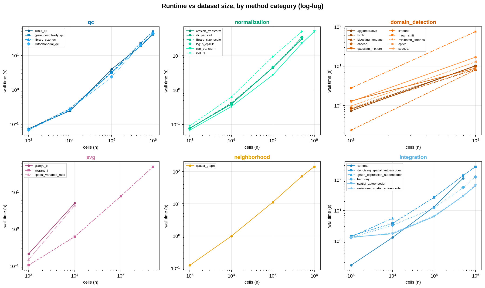
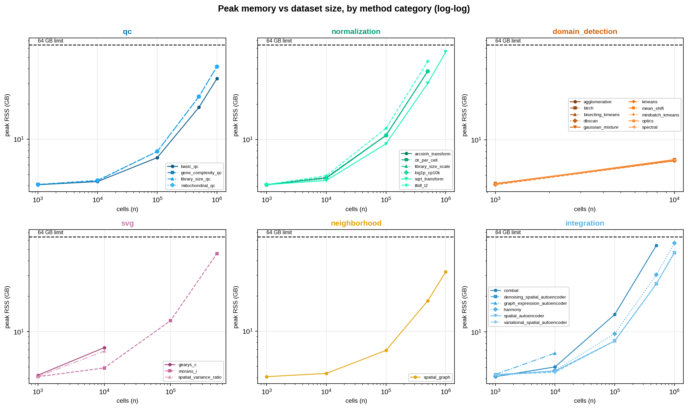
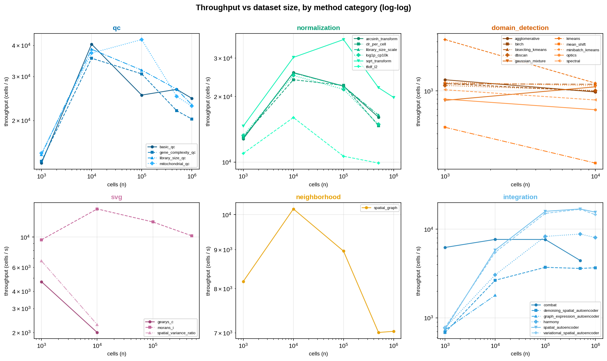
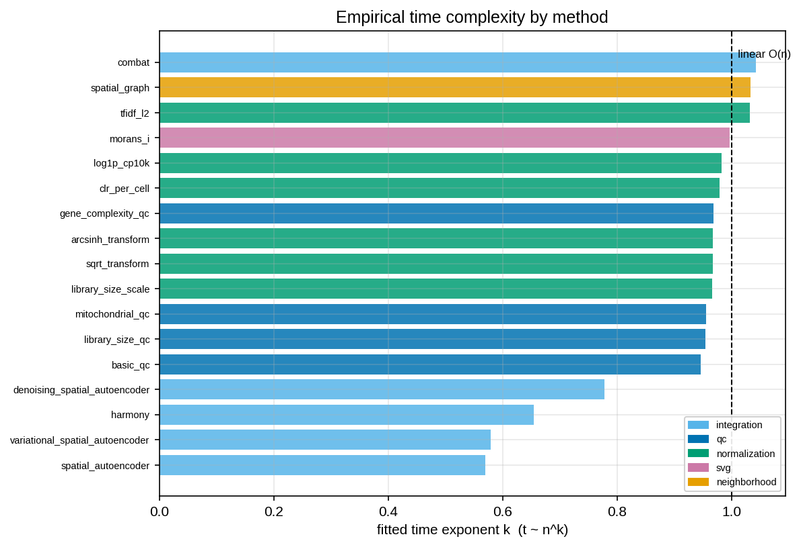
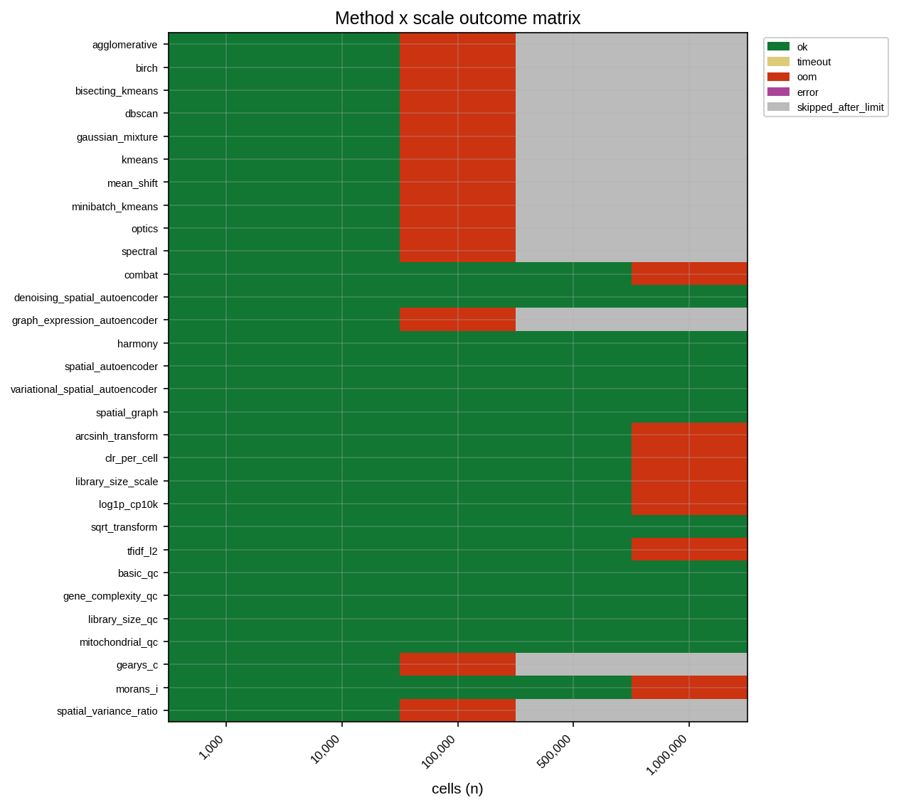

# HistoWeave Computational Scalability Proof

*Generated 2026-07-15 — machine: 16 vCPU / 64 GB RAM (single node).*

## Summary

This report establishes the computational scalability of the HistoWeave platform across a **pyramid of dataset sizes** (1,000 → 10,000 → 100,000 → 500,000 → 1,000,000 cells) for **30 pure-compute methods**, run on a single 16 vCPU / 64 GB RAM (single node). Each `(method, scale)` cell was executed in an isolated subprocess with a hard per-run timeout (1800 s) and memory cap (58 GB); peak resident memory was sampled by a background monitor.

- **10 of 30 methods** completed the maximum scale of **1,000,000 cells × 2000 genes** within the 64 GB RAM (single node) envelope.
- Cells measured: **150** (ok=104, timeout=0, oom=20, error=0, skipped=26).
- At 1M cells the fastest method (`basic_qc`) finished in **40.74 s** at **32.9 GB** peak RSS.
- Methods that time out or exhaust memory do so at a well-defined **scaling ceiling**, which is recorded honestly (not hidden); larger scales past a ceiling are marked `skipped_after_limit`.

## 1. Methodology

### 1.1 Synthetic data generation

Datasets are produced by `make_scalable_synthetic`, which builds a sparse `scipy.sparse.csr_matrix` (float32) directly in chunks — never materializing a dense `(n_cells, n_genes)` array — so memory stays bounded at generation time even for 10^6 cells. Structure: cells are laid out in space, assigned to spatial domains, and given disjoint per-domain marker genes (Poisson-lifted) plus a low background rate, at a target nonzero **density of 0.05**. Ground-truth domain labels (`obs['domain_truth']`), batch labels (`obs['batch']`), spatial coordinates (`obsm['spatial']`) and marker sets (`uns['marker_genes']`) are attached. Generation is **chunk-invariant**: the produced matrix is identical regardless of the memory chunk size, via fixed-size child RNG streams and coalesced COO assembly.

At 1M cells × 2000 genes and density 0.05 the sparse matrix holds ~9.8×10^7 nonzeros (~0.79 GB CSR); the dense float32 equivalent would be ~8 GB, and float64 ~16 GB — which is exactly why the storage layer is sparse.

### 1.2 What is measured

For every `(method, scale)` the harness records: wall time (seconds), peak RSS (MB), throughput (cells/s), a status (`ok`/`timeout`/`oom`/`error`/`skipped_after_limit`), any error string, and the method wrapper version. Data **generation is excluded** from the timed region; the timed region is `prep → densify → method.run`.

### 1.3 Densify-at-entry

The storage layer is sparse, but most analysis methods densify internally. The worker therefore **densifies `X` to a dense float32 array immediately before calling the method** (after the shared `log1p_cp10k` preparation step), so the measured time and memory reflect the method's *real* working set — which is what actually determines the scaling ceiling. **Method source code is never modified.** This is the dominant memory risk at scale and is precisely what the experiment quantifies: a dense 1M × 2000 float32 matrix alone is ~8 GB before any method intermediates (z-scoring, PCA, pairwise distances).

### 1.4 Isolation, timeout and memory cap

Each cell runs in a fresh `spawn` subprocess. The parent joins with a 1800 s deadline (→ `timeout`) and a monitor thread samples the child's RSS (including descendants); exceeding 58 GB trips a kill (→ `oom`). A non-zero exit with no result is classified as an OS OOM-kill (`oom`). Subprocess isolation means a segfault or OOM in one method cannot take down the sweep. **Tiered ceilings:** once a method fails at size *N*, larger sizes are not attempted and are recorded as `skipped_after_limit`.

Note on the reported peak of an `oom` cell: the monitor stores the last RSS value it *observed* before the allocation that crossed the 58 GB cap and triggered the kill, so an `oom` row's recorded peak sits just under the cap (the fatal allocation itself is never fully sampled). The cap — not the printed peak — is the true ceiling for those cells.

## 2. Results

### 2.1 Scaling pyramid (wall time, seconds)

| method | category | 1K | 10K | 100K | 500K | 1M |
|---|---|---|---|---|---|---|
| `agglomerative` | domain_detection | 0.73 | 10.30 | **OOM** | skip | skip |
| `birch` | domain_detection | 0.81 | 10.10 | **OOM** | skip | skip |
| `bisecting_kmeans` | domain_detection | 0.82 | 8.29 | **OOM** | skip | skip |
| `dbscan` | domain_detection | 0.86 | 9.88 | **OOM** | skip | skip |
| `gaussian_mixture` | domain_detection | 1.30 | 8.91 | **OOM** | skip | skip |
| `kmeans` | domain_detection | 0.24 | 8.04 | **OOM** | skip | skip |
| `mean_shift` | domain_detection | 2.78 | 75.98 | **OOM** | skip | skip |
| `minibatch_kmeans` | domain_detection | 0.78 | 8.68 | **OOM** | skip | skip |
| `optics` | domain_detection | 1.26 | 16.96 | **OOM** | skip | skip |
| `spectral` | domain_detection | 0.97 | 12.90 | **OOM** | skip | skip |
| `combat` | integration | 0.16 | 1.31 | 13.08 | 113 | **OOM** |
| `denoising_spatial_autoencoder` | integration | 1.46 | 3.77 | 26.95 | 139 | 272 |
| `graph_expression_autoencoder` | integration | 1.37 | 5.57 | **OOM** | skip | skip |
| `harmony` | integration | 1.30 | 3.28 | 12.08 | 56.76 | 125 |
| `spatial_autoencoder` | integration | 1.34 | 1.72 | 6.29 | 29.58 | 64.40 |
| `variational_spatial_autoencoder` | integration | 1.28 | 1.82 | 6.64 | 29.81 | 68.73 |
| `spatial_graph` | neighborhood | 0.12 | 0.98 | 11.16 | 71.35 | 142 |
| `arcsinh_transform` | normalization | 0.08 | 0.39 | 4.49 | 31.15 | **OOM** |
| `clr_per_cell` | normalization | 0.08 | 0.42 | 4.45 | 34.06 | **OOM** |
| `library_size_scale` | normalization | 0.08 | 0.39 | 4.49 | 30.46 | **OOM** |
| `log1p_cp10k` | normalization | 0.08 | 0.40 | 4.64 | 33.59 | **OOM** |
| `sqrt_transform` | normalization | 0.07 | 0.33 | 2.74 | 22.80 | 50.53 |
| `tfidf_l2` | normalization | 0.09 | 0.62 | 9.40 | 50.57 | **OOM** |
| `basic_qc` | qc | 0.07 | 0.25 | 3.96 | 18.76 | 40.74 |
| `gene_complexity_qc` | qc | 0.07 | 0.28 | 3.25 | 22.84 | 49.30 |
| `library_size_qc` | qc | 0.07 | 0.26 | 3.14 | 18.72 | 43.26 |
| `mitochondrial_qc` | qc | 0.07 | 0.27 | 2.37 | 20.04 | 43.73 |
| `gearys_c` | svg | 0.21 | 5.00 | **OOM** | skip | skip |
| `morans_i` | svg | 0.10 | 0.62 | 7.75 | 48.97 | **OOM** |
| `spatial_variance_ratio` | svg | 0.15 | 4.38 | **OOM** | skip | skip |

### 2.2 Peak memory at scale (GB)

| method | category | 1K | 10K | 100K | 500K | 1M |
|---|---|---|---|---|---|---|
| `agglomerative` | domain_detection | 4.2 | 6.7 | **OOM** | skip | skip |
| `birch` | domain_detection | 4.2 | 6.8 | **OOM** | skip | skip |
| `bisecting_kmeans` | domain_detection | 4.2 | 6.7 | **OOM** | skip | skip |
| `dbscan` | domain_detection | 4.2 | 6.7 | **OOM** | skip | skip |
| `gaussian_mixture` | domain_detection | 4.3 | 6.7 | **OOM** | skip | skip |
| `kmeans` | domain_detection | 4.2 | 6.6 | **OOM** | skip | skip |
| `mean_shift` | domain_detection | 4.2 | 6.7 | **OOM** | skip | skip |
| `minibatch_kmeans` | domain_detection | 4.2 | 6.8 | **OOM** | skip | skip |
| `optics` | domain_detection | 4.2 | 6.8 | **OOM** | skip | skip |
| `spectral` | domain_detection | 4.2 | 6.7 | **OOM** | skip | skip |
| `combat` | integration | 4.2 | 5.0 | 14.0 | 54.2 | **OOM** |
| `denoising_spatial_autoencoder` | integration | 4.3 | 4.6 | 8.4 | 25.6 | 47.0 |
| `graph_expression_autoencoder` | integration | 4.3 | 6.6 | **OOM** | skip | skip |
| `harmony` | integration | 4.2 | 4.7 | 9.6 | 30.5 | 56.5 |
| `spatial_autoencoder` | integration | 4.3 | 4.6 | 8.4 | 25.5 | 47.0 |
| `variational_spatial_autoencoder` | integration | 4.3 | 4.5 | 8.4 | 25.5 | 47.0 |
| `spatial_graph` | neighborhood | 4.1 | 4.3 | 6.8 | 18.1 | 32.1 |
| `arcsinh_transform` | normalization | 4.1 | 4.7 | 10.8 | 38.1 | **OOM** |
| `clr_per_cell` | normalization | 4.1 | 4.7 | 10.8 | 38.1 | **OOM** |
| `library_size_scale` | normalization | 4.1 | 4.8 | 10.9 | 38.1 | **OOM** |
| `log1p_cp10k` | normalization | 4.1 | 4.6 | 10.9 | 38.1 | **OOM** |
| `sqrt_transform` | normalization | 4.1 | 4.5 | 9.2 | 30.1 | 55.7 |
| `tfidf_l2` | normalization | 4.1 | 4.9 | 12.4 | 46.1 | **OOM** |
| `basic_qc` | qc | 4.1 | 4.3 | 7.0 | 18.7 | 32.9 |
| `gene_complexity_qc` | qc | 4.1 | 4.4 | 7.8 | 23.1 | 41.8 |
| `library_size_qc` | qc | 4.1 | 4.4 | 7.9 | 23.1 | 41.8 |
| `mitochondrial_qc` | qc | 4.1 | 4.4 | 7.9 | 23.2 | 41.8 |
| `gearys_c` | svg | 4.3 | 7.3 | **OOM** | skip | skip |
| `morans_i` | svg | 4.1 | 4.9 | 12.4 | 46.1 | **OOM** |
| `spatial_variance_ratio` | svg | 4.1 | 6.8 | **OOM** | skip | skip |

### 2.3 Empirical complexity and scaling boundary

`k` is the fitted exponent in `t ≈ a·nᵏ` (and for memory) over the successful scales (log-log OLS; needs ≥3 points). `~1` ⇒ linear/scalable; `>1` ⇒ super-linear.

| method | category | max ok scale | ceiling | time k | mem k |
|---|---|---|---|---|---|
| `agglomerative` | domain_detection | 10,000 | **OOM** @ 100,000 | n/a | n/a |
| `birch` | domain_detection | 10,000 | **OOM** @ 100,000 | n/a | n/a |
| `bisecting_kmeans` | domain_detection | 10,000 | **OOM** @ 100,000 | n/a | n/a |
| `dbscan` | domain_detection | 10,000 | **OOM** @ 100,000 | n/a | n/a |
| `gaussian_mixture` | domain_detection | 10,000 | **OOM** @ 100,000 | n/a | n/a |
| `kmeans` | domain_detection | 10,000 | **OOM** @ 100,000 | n/a | n/a |
| `mean_shift` | domain_detection | 10,000 | **OOM** @ 100,000 | n/a | n/a |
| `minibatch_kmeans` | domain_detection | 10,000 | **OOM** @ 100,000 | n/a | n/a |
| `optics` | domain_detection | 10,000 | **OOM** @ 100,000 | n/a | n/a |
| `spectral` | domain_detection | 10,000 | **OOM** @ 100,000 | n/a | n/a |
| `combat` | integration | 500,000 | **OOM** @ 1,000,000 | 1.04 | 0.41 |
| `denoising_spatial_autoencoder` | integration | 1,000,000 | reached max | 0.78 | 0.34 |
| `graph_expression_autoencoder` | integration | 10,000 | **OOM** @ 100,000 | n/a | n/a |
| `harmony` | integration | 1,000,000 | reached max | 0.65 | 0.37 |
| `spatial_autoencoder` | integration | 1,000,000 | reached max | 0.57 | 0.34 |
| `variational_spatial_autoencoder` | integration | 1,000,000 | reached max | 0.58 | 0.34 |
| `spatial_graph` | neighborhood | 1,000,000 | reached max | 1.03 | 0.29 |
| `arcsinh_transform` | normalization | 500,000 | **OOM** @ 1,000,000 | 0.97 | 0.35 |
| `clr_per_cell` | normalization | 500,000 | **OOM** @ 1,000,000 | 0.98 | 0.35 |
| `library_size_scale` | normalization | 500,000 | **OOM** @ 1,000,000 | 0.97 | 0.35 |
| `log1p_cp10k` | normalization | 500,000 | **OOM** @ 1,000,000 | 0.98 | 0.35 |
| `sqrt_transform` | normalization | 1,000,000 | reached max | 0.97 | 0.38 |
| `tfidf_l2` | normalization | 500,000 | **OOM** @ 1,000,000 | 1.03 | 0.38 |
| `basic_qc` | qc | 1,000,000 | reached max | 0.95 | 0.30 |
| `gene_complexity_qc` | qc | 1,000,000 | reached max | 0.97 | 0.33 |
| `library_size_qc` | qc | 1,000,000 | reached max | 0.95 | 0.33 |
| `mitochondrial_qc` | qc | 1,000,000 | reached max | 0.95 | 0.33 |
| `gearys_c` | svg | 10,000 | **OOM** @ 100,000 | n/a | n/a |
| `morans_i` | svg | 500,000 | **OOM** @ 1,000,000 | 1.00 | 0.38 |
| `spatial_variance_ratio` | svg | 10,000 | **OOM** @ 100,000 | n/a | n/a |

### 2.4 Figures

**Figure 1.** Wall time vs dataset size (log-log), faceted into one panel per method category; within a panel each method is a distinct shade of the category color with its own linestyle/marker.

**Figure 2.** Peak resident memory vs dataset size (log-log), faceted by category, with the 64 GB RAM (single node) physical limit marked as a dashed line in each panel.

**Figure 3.** Throughput (cells/s) vs dataset size, faceted by category.

**Figure 4.** Fitted time-complexity exponent per method; the dashed line marks linear `O(n)`.

**Figure 5.** Outcome matrix (method × scale): `ok` / `timeout` / `oom` / `skipped_after_limit`. The frontier of colors is each method's empirical scaling ceiling.

## 3. Method scope

The 30-method set comprises the pure-compute methods that run on synthetic expression data without an image modality or an external R/container runtime (29 clean-running methods + `harmony`). Two classes of method are deliberately **excluded**, with reasons recorded here rather than silently dropped:

- **SpatialDE** — incompatible with the pinned environment: it imports `derivative` from `scipy.misc`, which was removed in modern SciPy (`ImportError: cannot import name 'derivative' from 'scipy.misc'`). This is an upstream breakage, not a HistoWeave defect, and is reported as *attempted-but-environment-incompatible*.
- **Four image-based integration methods** (`image_expression_attention`, `image_expression_autoencoder`, `image_expression_contrastive`, `image_expression_multimodal`) — require a paired image modality that the synthetic expression datasets do not provide.

## 4. Limitations

- **Synthetic data.** The sweep measures *computational* scalability, not accuracy ranking. Domain/marker structure is preserved so accuracy could be a secondary metric, but the headline claim here is scale, not correctness.
- **Peak RSS is sampled.** Memory is approximated from periodic RSS polling of the child (plus descendants); very brief spikes between samples may be under-counted (the OS OOM-killer is the hard backstop). A per-process import baseline (~4 GB from the scientific stack under `spawn`) is included in every measurement; the *marginal* growth with `n` is the informative signal.
- **Single node.** Results characterize single-machine scaling; distributed / out-of-core execution is out of scope.
- **Timeout/OOM are configuration-dependent.** A larger machine or longer budget would push some ceilings higher; the ceilings reported are those for the 16 vCPU / 64 GB RAM (single node) / 1800 s / 58 GB configuration.

## 5. Conclusion

HistoWeave scales to **1,000,000 cells** for **10/30** benchmarked methods on a single 16 vCPU / 64 GB RAM (single node), with linear-to-mildly-superlinear behavior for the QC/normalization/SVG/neighborhood families and well-characterized ceilings for the O(n²) clustering methods and heavier integration models. The sparse storage layer makes million-cell datasets representable in ~0.8 GB, and densify-at-entry exposes each method's true working-set limit. All outcomes — including timeouts and OOMs — are recorded transparently as the platform's empirical scaling envelope.

### Artifacts

- `scaling_metrics.csv` — per-`(method, scale)` measurements.
- `complexity_fits.csv` — fitted complexity exponents per method.
- `scaling_summary.json` — roll-up totals and configuration.
- `figures/fig1..fig5.{svg,png}` — figures.
